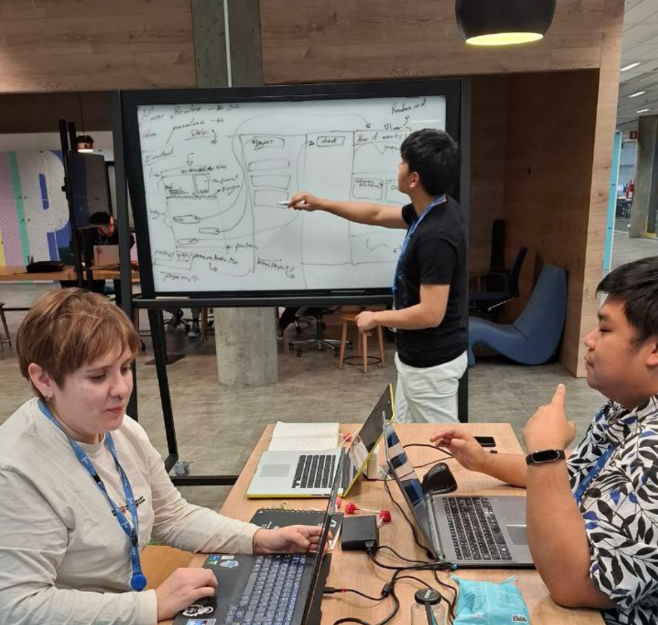
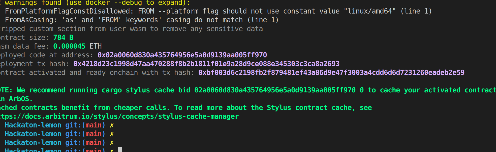
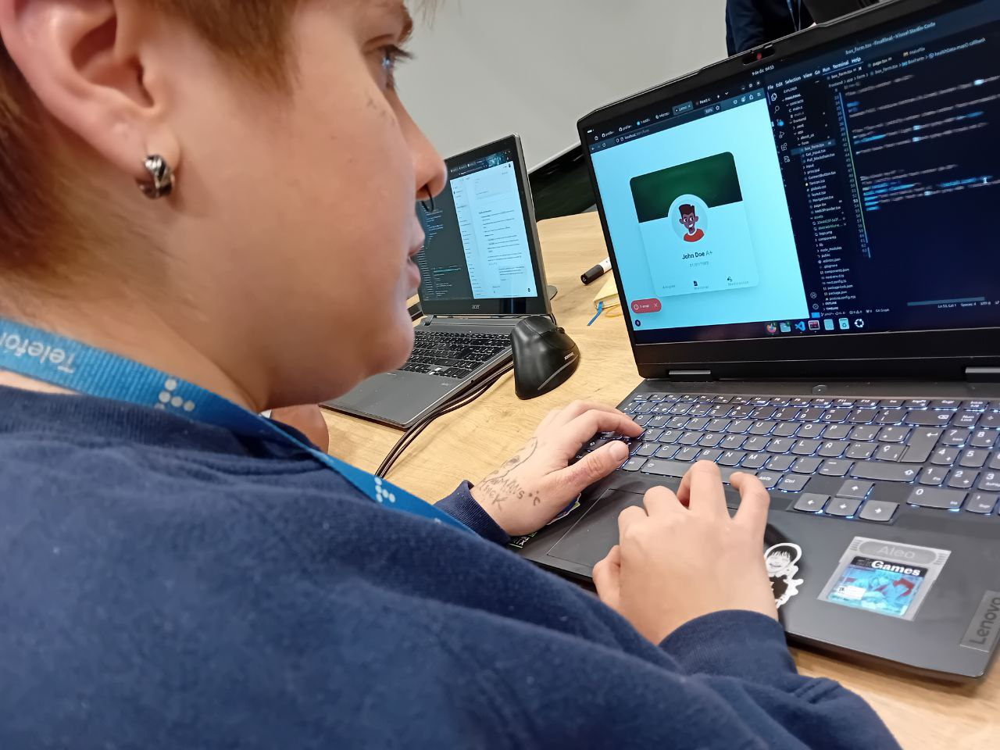
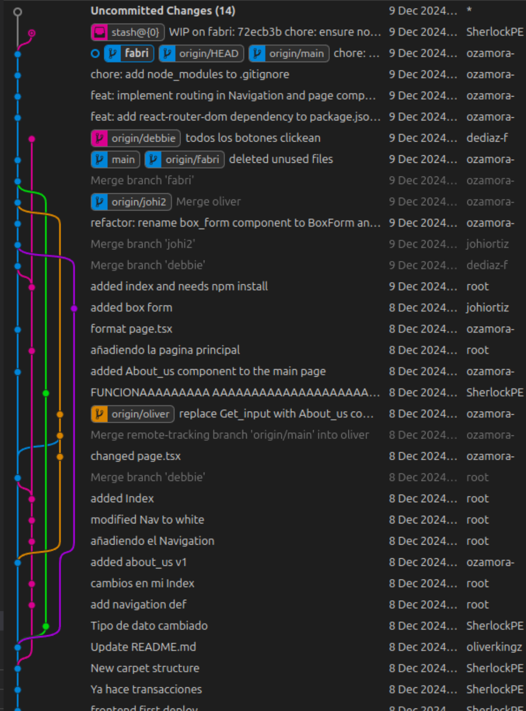
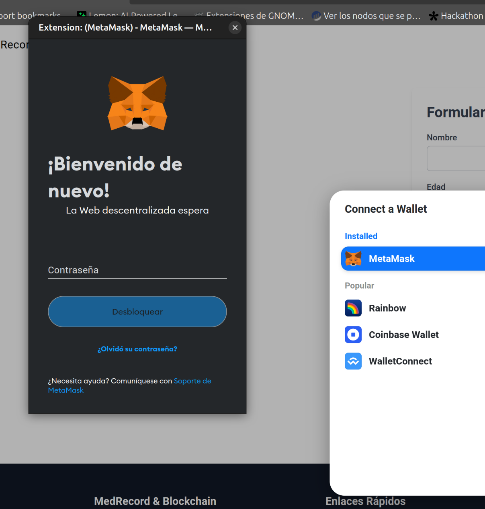
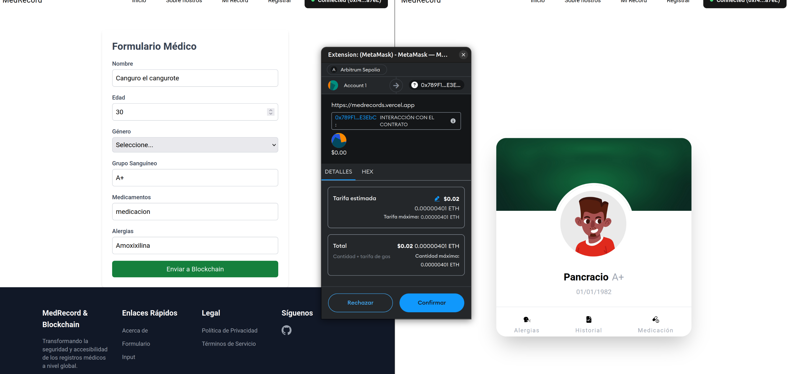
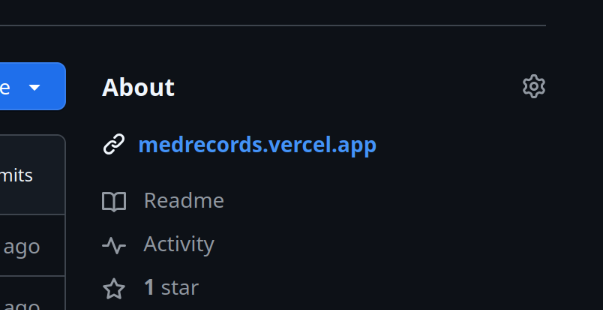
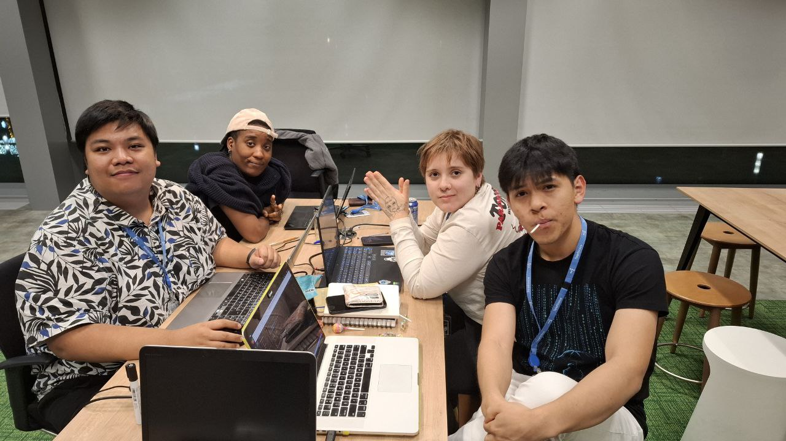

# Med-Records 
# Historial Clínico Descentralizado 📌

MedRecords es una plataforma web basada en tecnología blockchain que permite a las personas conectar su identidad con su historial clínico. Con Med-Records, la información médica estará disponible de manera segura y accesible en cualquier parte del mundo, especialmente útil en casos de emergencia o al viajar.


# Puedes visualizar nuestro proyecto a través de los siguientes enlaces:
- [Pagina Web de MedRecords](https://medrecords.vercel.app/)
- [Video Presentacion de MedRecords](https://drive.google.com/file/d/1EnQRRUjHy9yBwgPiMS0bmZBp182dW_hX/view?t=280)

---

## 🚀 Objetivo del Proyecto


MedRecords está diseñado para revolucionar la forma en que los historiales médicos son almacenados y compartidos. Buscamos garantizar la disponibilidad, seguridad y privacidad de los datos clínicos sin depender de servidores centralizados.

- **Acceso global:** Permitir a los usuarios consultar su historial médico en cualquier lugar del mundo, eliminando barreras geográficas.
- **Privacidad y seguridad:** Garantizar la protección de datos con tecnologías avanzadas de encriptación y un enfoque descentralizado.
- **Colaboración médica:** Facilitar el acceso rápido y seguro a información crítica para profesionales de la salud, mejorando diagnósticos y tratamientos en tiempo real.
---

## 📂 Estructura del Proyecto

- **`contracts/`**: Contiene los contratos inteligentes escritos en C.  
- **`stylus-sdk-c/`**: Dependencias del SDK para Stylus.  
- **`include/`**: Archivos de cabecera para definir las funciones del proyecto.  
- **`frontend/app/`**: Archivos encargados del frontend.  

---

## 🛠️ Tecnologías Utilizadas

Este proyecto combina herramientas y lenguajes avanzados para garantizar eficiencia y compatibilidad:  

- **WebAssembly (Wasm)**: Para garantizar un alto rendimiento y portabilidad.  
- **C**: Lenguaje utilizado para implementar smart contracts .  
- **Stylus SDK**: Para interactuar con redes descentralizadas.  
- **Ethereum Rollup**: Para almacenar de forma segura la información en redes
compatibles con contratos inteligentes.  
- **Clang**: Para compilar el código C.  
- **wasm-ld**: Enlazador para WebAssembly.  
- **wasm-strip**: Herramienta para optimizar el tamaño del archivo `.wasm`.  
- **Cargo Stylus**: CLI para interactuar con la red Stylus.  
- **npm**: Para ejecutar scripts adicionales.  

---
## 🚀 Progreso del Proyecto

### Fase 1: Investigación y Planificación
- **Objetivo:** Definir los requisitos del proyecto y las tecnologías a utilizar.
- **Logros:** 
  - Investigación sobre tecnologías descentralizadas, de frontend y de blockchain.
  - Investigación sobre tecnologías como React.
  - Planificación del desarrollo del proyecto.

### Fase 2: Desarrollo Inicial
- **Objetivo:** Implementar la estructura básica del proyecto y los contratos inteligentes.
    
- **Logros:**
  - Creación de contratos inteligentes en C.<br>
    Nuestro Primer Smart contract:
    
  - Aprendizaje de React, Tailwind y Vercel para el hosting a través de peer-to-peer y recursos en línea.
  - Foto del equipo aprendiendo React y Tailwind:
    

### Fase 3: Integración y Pruebas.jpg
- **Objetivo:** Integrar los componentes del proyecto y realizar pruebas exhaustivas.
    

- **Logros:**
  - Integración del frontend con los contratos inteligentes.
    
    
  - Integración del frontend con los contratos inteligentes.
  - Aprendizaje de cómo funcionan los smart contracts y la blockchain.

### Fase 4: Despliegue y Documentación
- **Objetivo:** Desplegar el proyecto en un hosting como Vercel.<br/>
    
    
- **Logros:**
  - Creación de documentación para usuarios y desarrolladores.
  - Foto del equipo:
    
---


## 🛠️ Cómo Editar el Código y Ver los Cambios en Tiempo Real

Para editar el código y ver los cambios en tiempo real en un servidor local, sigue estos pasos:

### 1. Clonar el Repositorio

Primero, clona el repositorio en tu máquina local:

```bash
git clone https://github.com/SherlockPE/Hackaton-lemon.git 

cd Hackaton-lemon
```


2. Instalar Dependencias
Asegúrate de tener Node.js y npm instalados en tu máquina. Luego, instala las dependencias del proyecto:
```bash
npm install
```

3. Ejecutar el Servidor de Desarrollo
Para ejecutar el servidor de desarrollo y ver los cambios en tiempo real, utiliza el siguiente comando:

```bash
make frontend
```

Esto iniciará el servidor de desarrollo de Next.js. Abre tu navegador y navega a [localhost:3000](http://localhost:3000) para ver la aplicación en funcionamiento.

4. Para editar el Código
Puedes editar los archivos en la carpeta frontend y ver los cambios reflejados en tiempo real en tu navegador. Next.js se encargará de recargar automáticamente la página cuando detecte cambios en los archivos.


